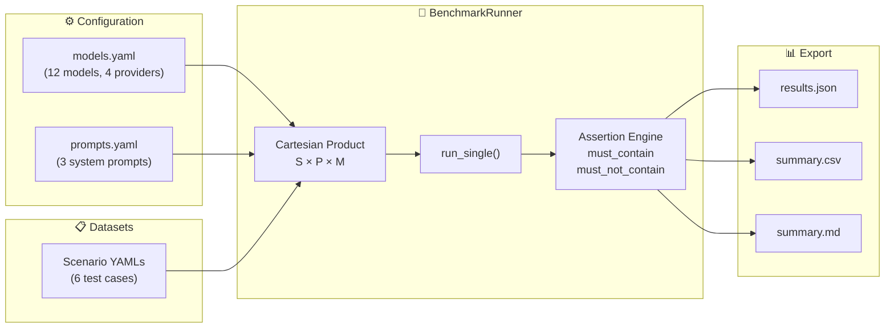
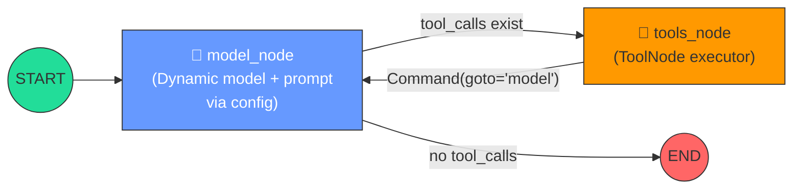
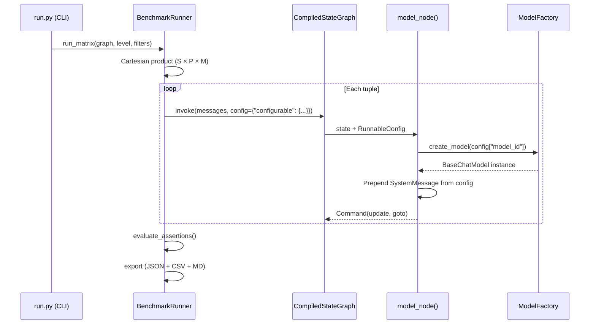

# 🧠 agent-memory-benchmark

**An experimental benchmark harness for evaluating memory architectures in LLM-based conversational agents.**

Measures how different persistence strategies affect logical consistency, belief revision, and information retention across multi-turn conversations — built with [LangGraph](https://langchain-ai.github.io/langgraph/), Pydantic v2, and a multi-provider model factory.

[](https://www.python.org/downloads/)
[](LICENSE)
[](https://langchain-ai.github.io/langgraph/)
[](https://docs.pydantic.dev/latest/)

---

## Table of Contents

- [Research Context](#research-context)
- [Architecture](#architecture)
- [Benchmark Scenarios](#benchmark-scenarios)
- [Quickstart](#quickstart)
- [Usage](#usage)
- [Sample Results](#sample-results)
- [Agent Levels Roadmap](#agent-levels-roadmap)
- [Project Structure](#project-structure)
- [Tech Stack](#tech-stack)
- [License](#license)

---

## Research Context

This project is the experimental component of an undergraduate thesis in Computer Science at **DCIC — Universidad Nacional del Sur** (Bahía Blanca, Argentina), supervised by **Dr. Alejandro J. García** and co-supervised by **Dr. Sebastián Gottifredi** at the **ICIC (CONICET-UNS)** Knowledge Representation & Reasoning (KRR) research group.

### Research Questions

| ID | Question |
|----|----------|
| **P1** | What is the minimal architecture needed to reliably manage contextual persistence across multiple sessions (*cross-thread*)? |
| **P2** | How does decoupling a reflection mechanism (*LLM-as-a-Judge*) affect handling of contradictory or extinct information (*A* vs. *¬A*)? |
| **P3** | What latency and token overhead does structured persistence introduce over a reactive (amnesic) baseline? |

The harness follows an **Evaluation-Driven Development (EDD)** methodology: benchmark scenarios with structured assertions are defined *before* building the agent architectures, ensuring that each design decision is empirically validated.

---

## Architecture

### Design Principle: Zero Hardcoding

Every benchmark execution is formalized as an **immutable tuple**:

$$\langle \text{Scenario},\, \text{System Prompt},\, \text{Model},\, \text{Persistence Level} \rangle$$

No graph or node has a model or prompt hardcoded at build time. All parameters are injected dynamically at runtime via LangGraph's `config["configurable"]` mechanism, enabling the runner to sweep the full **Cartesian product** (Scenarios × Prompts × Models) without any code changes.

### Harness Pipeline



### Agent Graph Topology (Level 0 — Reactive Baseline)



Routing is encapsulated **inside** each node via LangGraph `Command` objects — the modern post-0.2.x pattern — rather than external `add_conditional_edges()` declarations.

### Dynamic Injection Flow



---

## Benchmark Scenarios

Six scenarios designed to stress-test different memory failure modes:

| Scenario | Category | Turns | Difficulty | Research Question | What It Tests |
|----------|----------|:-----:|:----------:|:-----------------:|---------------|
| `belief_revision_01` | Belief Revision | 5 | Basic | P2 | Agent updates beliefs when user contradicts a prior fact (*A → ¬A*) |
| `attrition_01` | Attrition | 8 | Moderate | P1 | Retention of early facts after 6 unrelated distractor turns |
| `needle_haystack_01` | Needle in Haystack | 5 | Moderate | P1 | Precise extraction of one detail from dense multi-entity context |
| `explicit_forget_01` | Selective Unlearning | 5 | Moderate | P2 | Formal retraction of a credential while preserving other facts |
| `temporal_multi_hop_01` | Multi-Hop Reasoning | 4 | Moderate | P1 | Compositional deduction over facts distributed across turns |
| `in_context_control_01` | Positive Control | 1 | Basic | P2 | Single-turn baseline — all premises in one prompt (upper bound) |

Each scenario is a YAML file with structured `assertions` per turn (`must_contain` / `must_not_contain`), enabling fully automated pass/fail evaluation without human judgment.

---

## Quickstart

### Prerequisites

- Python 3.10+
- At least one LLM API key (Google AI Studio is free)

### Installation

```bash
git clone https://github.com/sgraziabile/agent-memory-benchmark.git
cd agent-memory-benchmark

# Create virtual environment
python -m venv .venv
.venv\Scripts\activate        # Windows
# source .venv/bin/activate   # macOS/Linux

# Install with dev dependencies
pip install -e ".[dev]"

# Configure environment
cp .env.example .env
# Edit .env and add your API key(s)
```

### Verify setup

```bash
pytest tests/ -v              # Run harness tests (no API keys needed)
python run.py --list-models   # List registered models
python run.py --list-scenarios
```

---

## Usage

### Run a single scenario

```bash
python run.py --model gemini-3.8-flash --scenario belief_revision_01
```

### Run with a specific system prompt

```bash
python run.py --model gemini-3.8-flash --scenario belief_revision_01 --prompt strict_epistemic
```

### Run all scenarios

```bash
python run.py --model gemini-3.8-flash --scenario all
```

### Use an unregistered model (inline provider format)

```bash
python run.py --model openai:gpt-4o --scenario attrition_01
python run.py --model google:gemini-2.0-flash --scenario needle_haystack_01
```

### Available options

```
python run.py --help

  --model, -m       Model ID or provider:model_name  (default: gemini-3.8-flash)
  --scenario, -s    Scenario ID or 'all'             (default: belief_revision_01)
  --prompt, -p      Prompt ID from prompts.yaml      (default: baseline_react)
  --level, -l       Agent persistence level           (default: level_0_reactive)
  --verbose, -v     Enable debug logging
  --list-models     List registered models and exit
  --list-scenarios  List available scenarios and exit
  --list-prompts    List system prompts and exit
```

Results are exported automatically to `outputs/runs/<timestamp>/` in three formats: `results.json`, `summary.csv`, and `summary.md`.

---

## Sample Results

### Level 0 Baseline — `gemini-3.5-flash-lite` × `baseline_react`

These results demonstrate the **amnesic baseline** (no checkpointer, no memory, no persistence):

| Scenario | Pass Rate | Avg Latency | Total Tokens | Outcome |
|----------|:---------:|:-----------:|:------------:|---------|
| `in_context_control_01` | **100.0%** | 1,709 ms | 192 | ✅ Upper bound — all context in single turn |
| `attrition_01` | **66.7%** | 1,844 ms | 1,477 | ⚠️ Partial recall — early facts partially retained |
| `temporal_multi_hop_01` | **50.0%** | 1,867 ms | 513 | ⚠️ Cannot compose facts across turns |
| `explicit_forget_01` | **40.0%** | 1,875 ms | 758 | ⚠️ Amnesia trivially passes forget, but fails recall |
| `belief_revision_01` | **28.6%** | 10,929 ms | 715 | ❌ Fails to update beliefs across turns |
| `needle_haystack_01` | **0.0%** | 2,504 ms | 937 | ❌ Fails dense multi-entity retrieval |

> **Key insight:** The positive control (`in_context_control_01`) achieves 100% as expected — the model *can* process contradictions when all premises are in a single prompt. Failures in multi-turn scenarios confirm that the degradation is a **persistence problem**, not a reasoning problem. This validates the thesis hypothesis and motivates Level 1+ architectures.

> **Measurement validity:** Model instances are cached per configuration (`lru_cache` in `core/model_factory.py`), so after the first invocation per `(model_id, temperature, config)` tuple, each measured turn reflects model inference and graph orchestration only — not YAML re-reads or provider client construction. Additionally, errored turns (e.g., API outages) are flagged and excluded from pass-rate, latency, and token metrics, so infrastructure failures never contaminate benchmark numbers.

---

## Agent Levels Roadmap

The harness evaluates agents across an **ablation ladder** of increasing persistence:

| Level | Name | Persistence | Status |
|:-----:|------|-------------|:------:|
| **L0** | Reactive (Amnesic) | None — stateless baseline | ✅ Implemented |
| **L1** | Thread Memory | `MemorySaver` checkpointer — within-thread persistence | 🔲 Planned |
| **L2** | Cross-Thread Store | `BaseStore` — shared memory across threads | 🔲 Planned |
| **L3** | Reflective Memory | L2 + LLM-as-a-Judge reflection on memory conflicts | 🔲 Planned |
| **L4** | Structured Belief State | L3 + explicit belief graph with revision operators | 🔲 Planned |

Each level shares the same runner, scenarios, and assertion engine — only the agent graph changes. The `BaseBenchmarkAgent` abstract interface enforces this contract.

---

## Project Structure

```
agent-memory-benchmark/
├── agents/
│   ├── base.py                          # Abstract BaseBenchmarkAgent interface
│   └── level_0_reactive/
│       └── graph.py                     # L0 stateless graph (Command routing)
├── configs/
│   ├── models.yaml                      # 12 models across 4 providers
│   └── prompts.yaml                     # 3 system prompts (baseline, epistemic, minimal)
├── core/
│   ├── model_factory.py                 # Dynamic multi-provider LLM instantiator
│   ├── runner.py                        # Cartesian product orchestrator + export
│   └── schemas.py                       # Pydantic v2 contracts + LangGraph state
├── datasets/
│   └── conversations/                   # Scenario YAMLs, organized by research theme
│       ├── logical_consistency/         # belief_revision, explicit_forget, in_context_control
│       ├── retention_persistence/       # attrition, needle_haystack
│       ├── compositional_reasoning/     # temporal_multi_hop
│       ├── robustness_security/         # empty (.gitkeep) — planned tests
│       └── computational_cost/          # empty (.gitkeep) — planned tests
├── outputs/
│   ├── runs/                            # Timestamped results (JSON + CSV + Markdown)
│   └── by_theme/                        # Runs reorganized by theme/category (generated)
├── tests/
│   └── test_scaffolding.py              # 28 deterministic harness tests
├── .env.example                         # Environment variable template
├── pyproject.toml                       # Dependencies and build config
├── SPEC.md                              # Technical specification (Spanish)
└── README.md                            # This file
```

---

## Tech Stack

| Component | Technology |
|-----------|-----------|
| Agent Framework | [LangGraph](https://langchain-ai.github.io/langgraph/) ≥ 0.2.0 |
| Data Contracts | [Pydantic](https://docs.pydantic.dev/latest/) v2 |
| LLM Providers | Google GenAI, OpenAI, Anthropic, Groq, Ollama |
| Scenario Format | YAML with structured assertion rules |
| Testing | pytest ≥ 8.0, pytest-asyncio |
| Packaging | Hatchling (`pyproject.toml`) |
| Tracing | LangSmith (optional) |

---

## License

[MIT](LICENSE) — Stefano Grazia
